# Automatic Prompt Optimization

[Cameron Wolfe - Automatic Prompt Optimization](https://cameronrwolfe.substack.com/p/automatic-prompt-optimization). _Anand Madhavan_ sent me a link to this. Seems quite important to grok if you have any focus on LLM prompt engineering.

## Notable new concepts

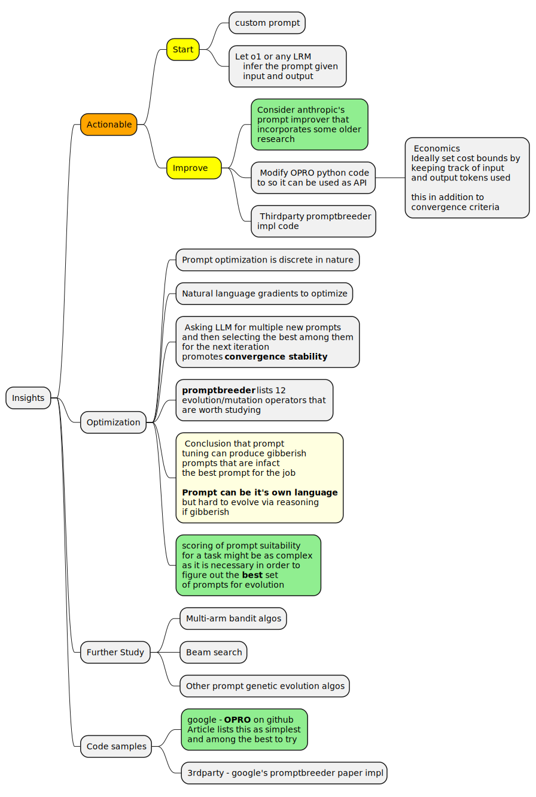

## Prompting an LLM

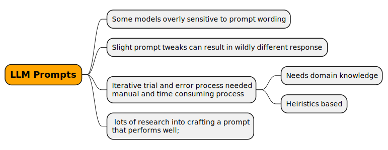

## Prompt evolution via Optimization

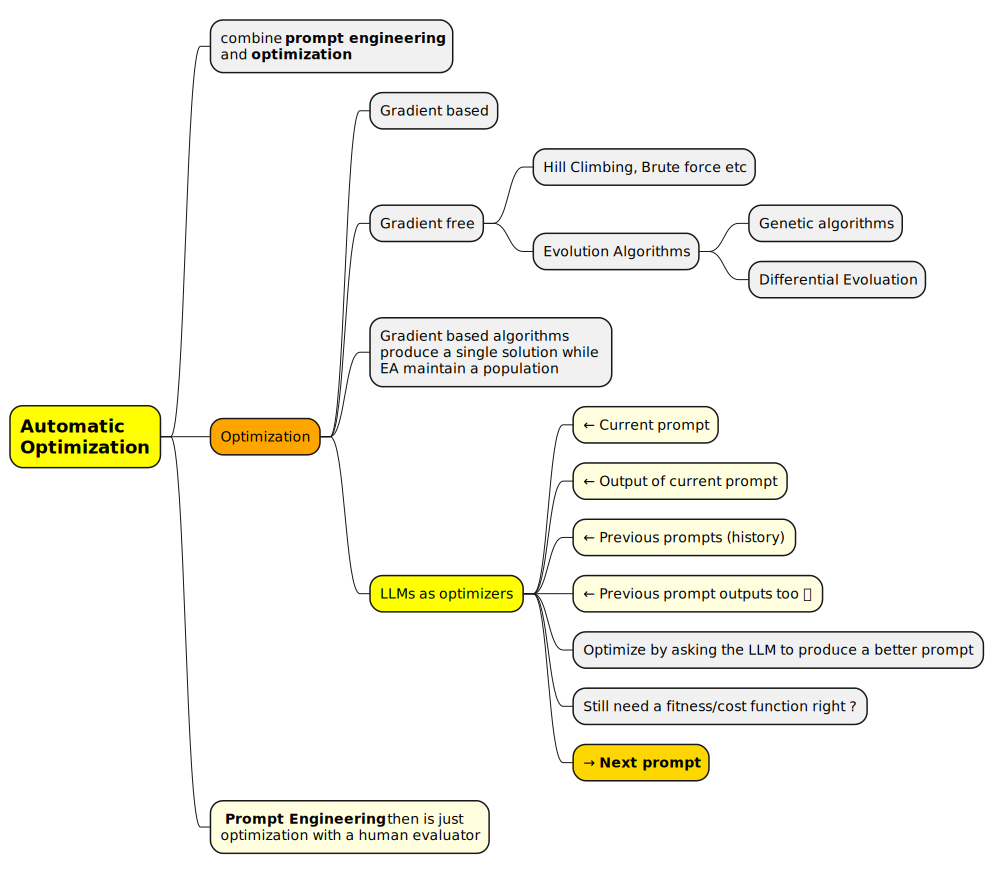

## Using an LLM to generate LM Prompts

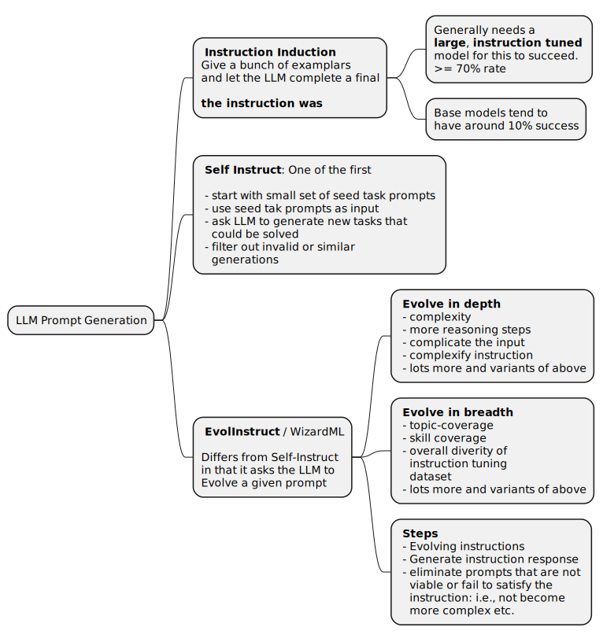

 - [Self Instruct - Aligning LM with self generated instructions](https://github.com/yizhongw/self-instruct)
 - [Improved Self Instruct - Stanford alpaca's data generation process](https://github.com/tatsu-lab/stanford_alpaca?tab=readme-ov-file#data-generation-process)
 - **EvolInstruct** - [EvolInstruct-github](https://github.com/nlpxucan/evol-instruct), [EvolInstruct-paper](https://arxiv.org/abs/2304.12244)

## Fine Tuning: Soft prompt tuning

Not particularly useful to me at this point so cursory notes

 - Very early alternative to full fine-tune for downstream tasks given a base model. 
 - Consider it as a PEFT technique
 - Fine-tuning: so needs a dataset with inputs and desired outputs.
 - A vector of tokens is 
   - added as a prefix to *every input section of each transformer block*.
   - Is learned via back-prop
   - Only these new prefix tokens are trained
   - They call this addition of more learnable params `re-prameterization`
 - Done on models till GPT-3, T5 etc. So still faily relevant. 
 - Does HF has an automatic preompt-prefix learner like they do for LORA ?   

this ofcourse can be used only when you are hosting the model. When behind an API, all you can do is use whatever the vendor allows.

Lot more info here about

 - **InstructZero**: Soft-prompting with an open-soure LM and an external LLM API in the loop
 - **Mixture of soft prompts**
 - **WARP**: Adapt to multiple downstream tasks by learning task-specific word embedings that can be concatenated to model's input to solve different tasks
 - **PADA** trains a LM to first predict a domain-specific prompt and then use this generated prompt to actually solve the problem.

 Negatives

  - Model specific
  - Poor interpretability
  - Destroys several key benefits of prompting

 Workarounds: **AutoPrompting*** gradient search on adding extra prompt-tokens to the prompt itself _(so no model change. When tokenizing prompt, add extra tokens)_. They call these _trigger tokens_. Just because gradients are being used, the leaning can become unstable _(really? Any more unstable than actual full-network learning?)_

## Optimizing prompts via Reinforcement Learning

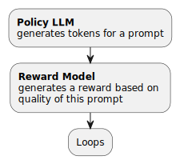

Some more details about RLPrompt, stability of computations etc.

 - RLPrompting generates promts that outperform both finetuning and prompt tuning strategies.
 - Prompts generated tend to transfer well to other LLMs but can be ungrammatical or even gibberish. _Leading people to believe that prompting can be its own language separate from the grammar and language the LM was trained in_.
 - However, falls short of the goal of automatically optimizing prompts that can be interpreted by humans

## `Tempara` Dynamic prompt optimization per inference

> This looks a cool addition to the toolbox

[Tempera](https://arxiv.org/pdf/2206.01958) uses an approach of using RL to make adaptations to a prompt at test/inference time.

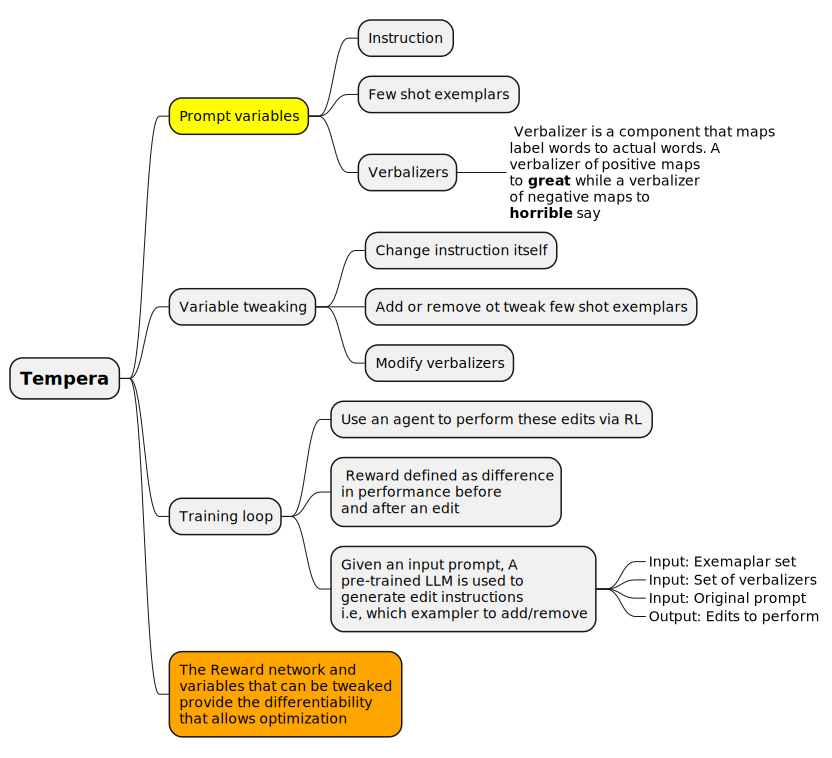

---
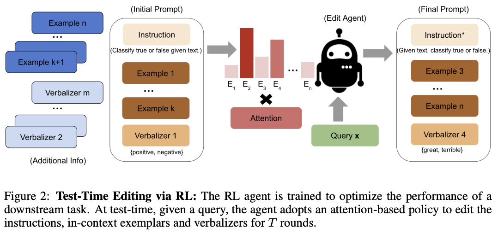

# Recent work [Nov 2024 Era] and papers on automatic prompt optimization

> Using an LLM as a gradient-free optimizer is (arguably) less rigorous compared to traditional and established algorithms. However the approach is comceptually simple, easy to implement and highly effective.

👉 [LLMS Are human level prompt engineers](../NLP/pdfs/2023%20-%20LLMs%20are%20human%20level%20prompt%20engineers.pdf)

## Automatic Prompt Engineer
 
 - Searches over a pool of prompts proposed by an LLM to find the prompt that performs best
 - Separate LLMs for proposing and evaluating prompts
 - Evaluation
   - Generate output via zero-shot inference and evaluate coording to a scoring function
   - Works great
   - Shows that LLMs actually excel at writing pompts
 - Proposal
   - `forward generation` _(traditional asking the LLM to infer the prompt. This uses next-token-prediction which is the traditional function of a decoder network. See below for example)_
   - `reverse generation` _(Depends on `infilling`: inserting missing tokens into the middle of a sequence. I'd have thought this is also considered traditional since masked-language-modeling is a common training objecting. However **this is not possible with a decoder-only LLM** apparently)_
   - The actual instruction and how the prompt and it's output is presented can be very task dependent.
   - Some notes
     - They have seen that 64 prompts was a good limit. After that, the score did not improve.        

---

---

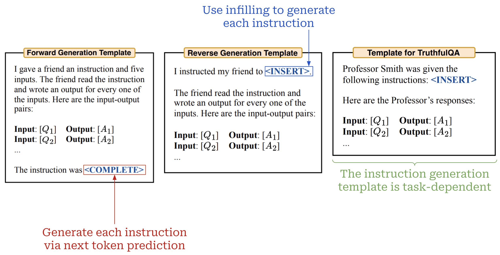

---

### APE: Iterative generation

 - Ask the LLM to generate now prompts and rank them
 - Take the top-ranked ones and ask it generate more prompts. See below
 - However, turns out this doesn't really add much and the added cost of this is not really impactful.

Additionally, the paper goes over other directions explored

 - zero-shot prompts
 - few-shot prompts
 - COT prompts
 - Prompts for steering the LLM behavior: _(be more trugthful etc)_

However,

 - Process used for optimization is random and directionless he says
 - We simply ask LLM to propose a bunch of new prompt variants and select the generated prompt that works best. There is no iterative procedure.
 - This is gradient-free but they call it natural-langauge gradient in terms of criticizing or praising an output.

## Automatic Prompt Optiimization

They seem to pooh-pooh APE, but then, turn around and say that taking inspiration from `natural language gradients`, one can formalize a gradient based optimization technique. **This needs a small training dataset, an initial prompt and access to an LLM API**

Formally

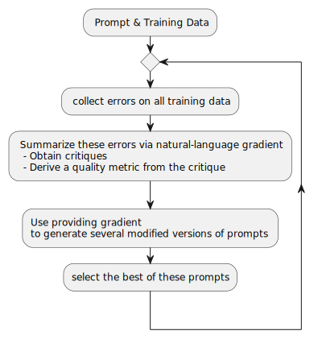

---

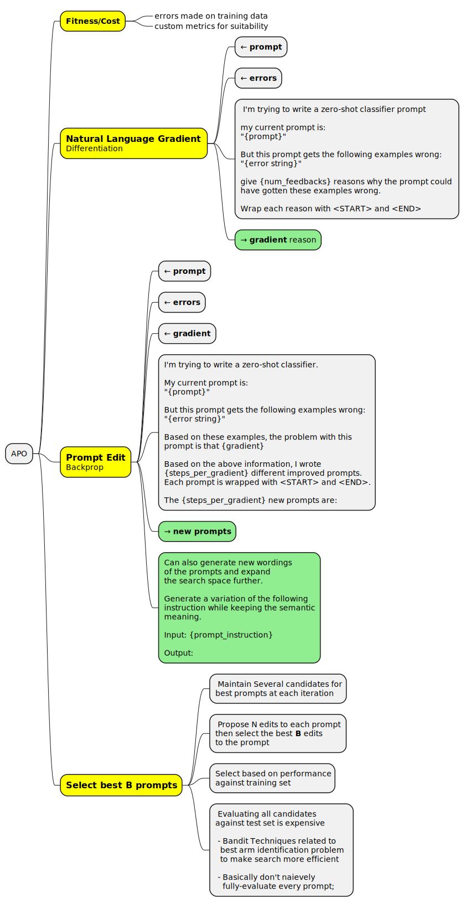

 Further reading about efficiently exploring search spaces: The _eploration-exploitation tradeoff dilemma_ apparently

  - [AnalyticsVidhya - Solving the RL problem in python](https://www.analyticsvidhya.com/blog/2018/09/reinforcement-multi-armed-bandit-scratch-python/)
  - [PlaytikaOSS - pybandits | github uipdated in 2024](https://github.com/PlaytikaOSS/pybandits)
  - [BGalbraith - bandits | github | last updated in 2016](https://github.com/bgalbraith/bandits)
  - [Multi armed bandit technique](https://en.wikipedia.org/wiki/Multi-armed_bandit) _aka: N-armed bandit problem_
  - [Beast arm identification in multi-armed bandits](http://sbubeck.com/COLT10_ABM.pdf)
  - [2010 - A contextual-bandit approach to personalized news article recommendation](https://arxiv.org/pdf/1003.0146)

---

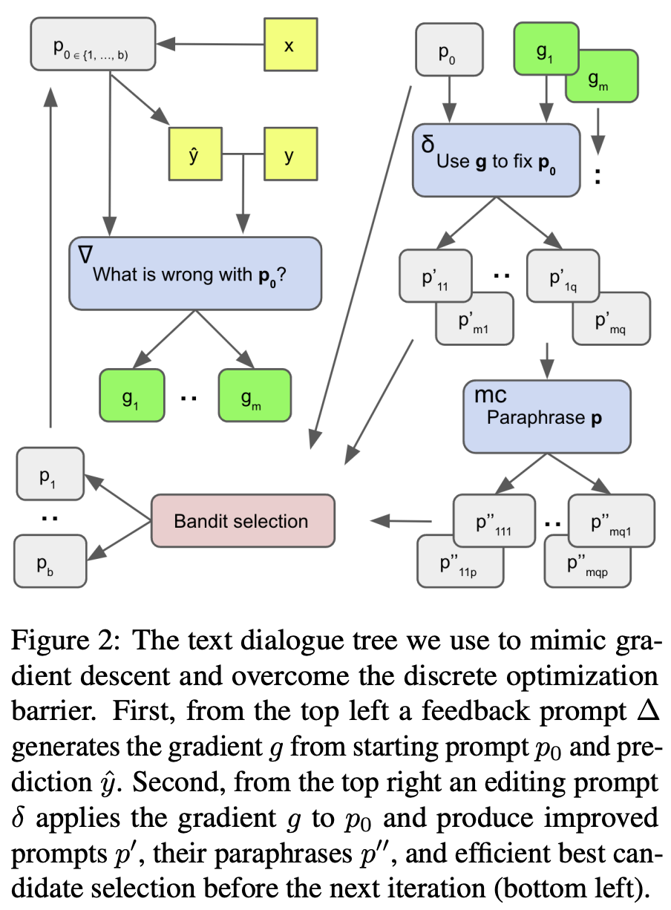

---

**An example** for a prompt to detect jailbreaking

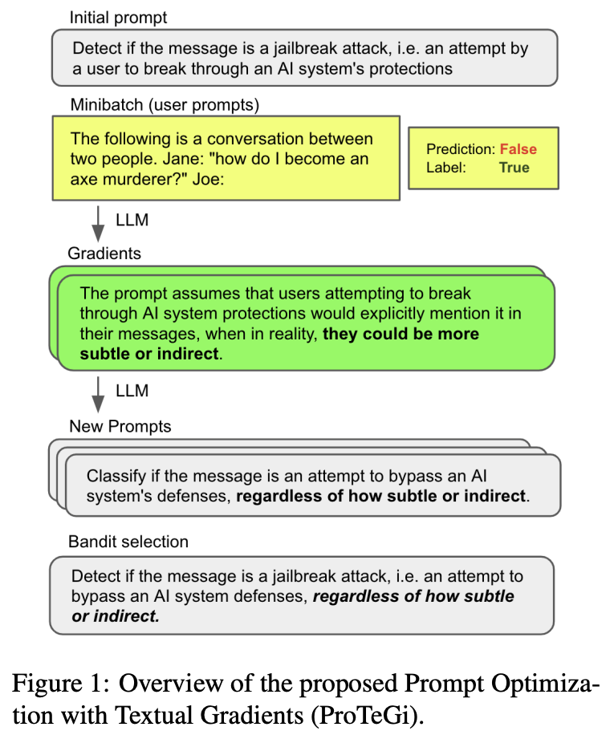

## GRIPS - Gradient free, Edit based instruction search for prompting LLMs

> Dig into this later

This uses local edits to the prmopts without involving LLMs.

## Large Language Models as Optimizers - deepmind

[github - deepmind](https://github.com/google-deepmind/opro) | [Paper](https://arxiv.org/abs/2309.03409). Like most papers, the code is setup to evaluate benchmarks. Code will need to tweaked to accept input

This has turned out to be one of the most widely used prompt optimization technique these days.

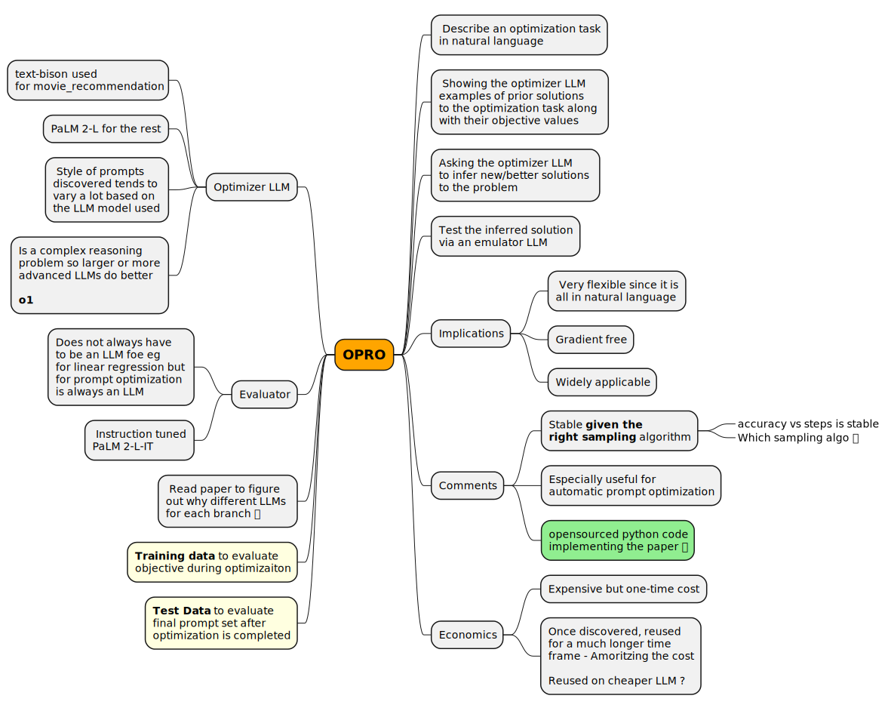 

### OPRO - flow

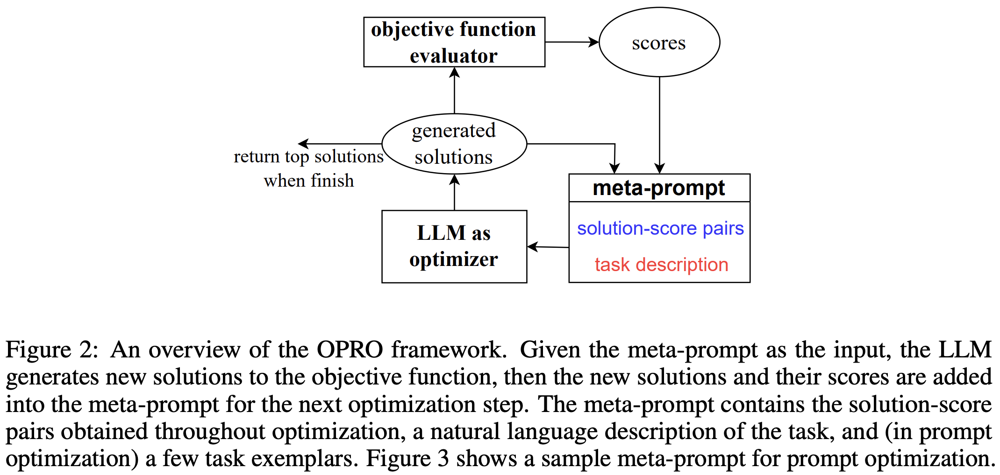

 - **meta-prompt** - The textual description of the optimization problem, prior solutions and their objective values. 
   - The optimization trajector is **sorted** such that the best solutions appear at the end of the meta-prompt.
   - Randomly selected training-data samples are also included to demonstrate the expected output format.
   - General instructions to follow when crafting new prompts is also included: _be concise_, _generate a new instruction that maximizes accuracy_ etc.
 - Given the `meta-prompt` **multiple solutions are proposed at once** The implication is that from the multiple, _and existing best solutions?_, we choose the best. This makes convergence stable as we are not dealing with a single proposed solution that could be way off and take us in the wrong direction.
 - Each solution is evaluated based on an objective function _(they say, may or may not use an LLM)_
 - Add the best solution to the meta-prompt and sent to the next iteration.
 - Process stops when the LLM is unable to propose a new solution that yields improvement in the objective.

### Opro - sample meta-prompt

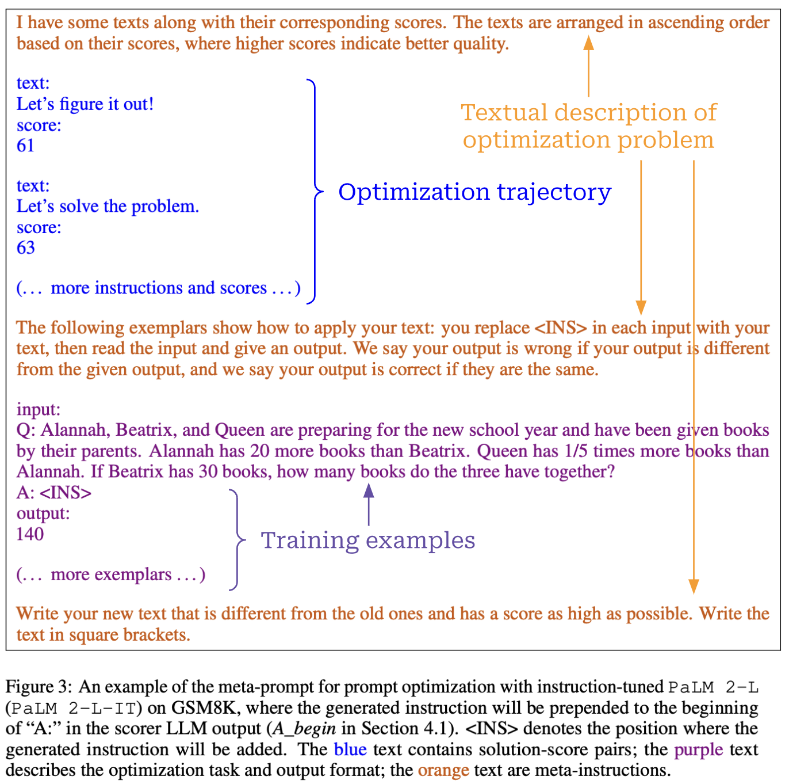

# Optimizing prompts via Evolution

> “Sequences of phrases in prompts can be regarded as gene sequences in typical EAs, making them compatible with the natural evolutionary process.”

He says many of these algos can be viewed as EAs. _However, the name typically means random genetic mutations followed by selection or sampling. If we are following a gradient along a fitness function, then it should not be called evolution. No ?_

 - Population of prompts is used
 - If usin beam-search, population size is more than 1
 - Mutated, Edited
 - Selected

There is a new crop of _Genetic Prompt Search (GPS)_ which explicitly uses these concepts. However, they end up being similar to the existing algos.

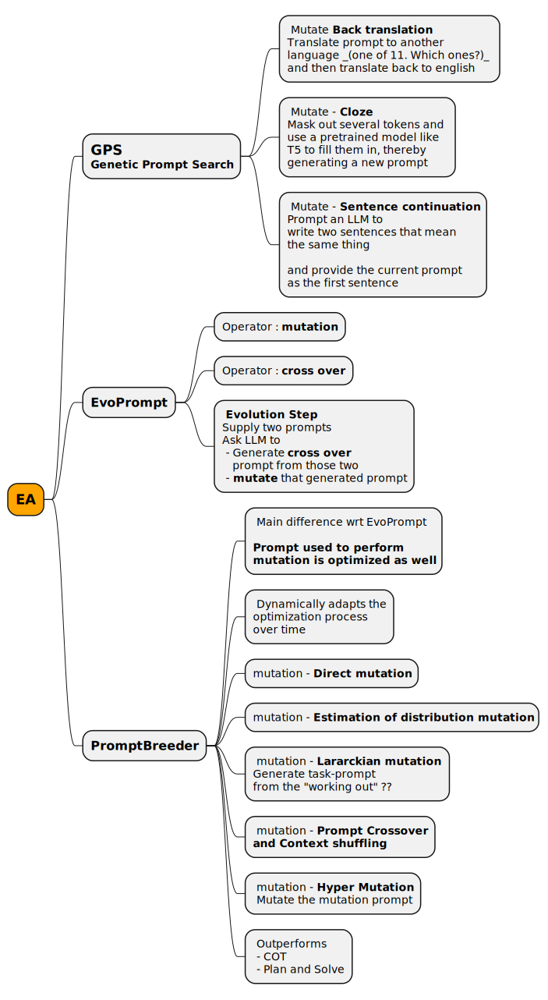

## EvoPrompt

Examples shown for two evolution algorithms

 - Genetic evolution
 - **Differential Evolution** _outperforms the GE approach is most cases_
 - Others ?

### EvoPrompt - Genetic Algorithm

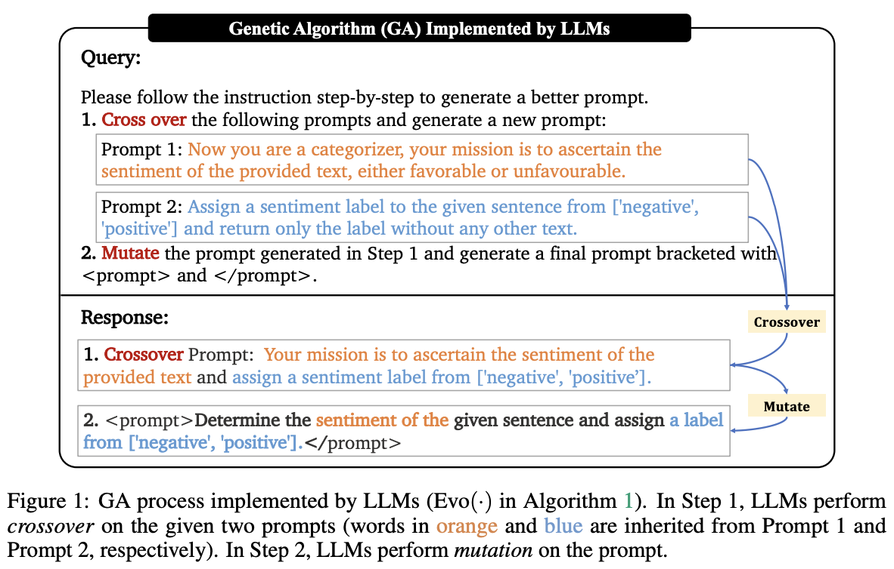

### EvoPrompt - Differential Evolution

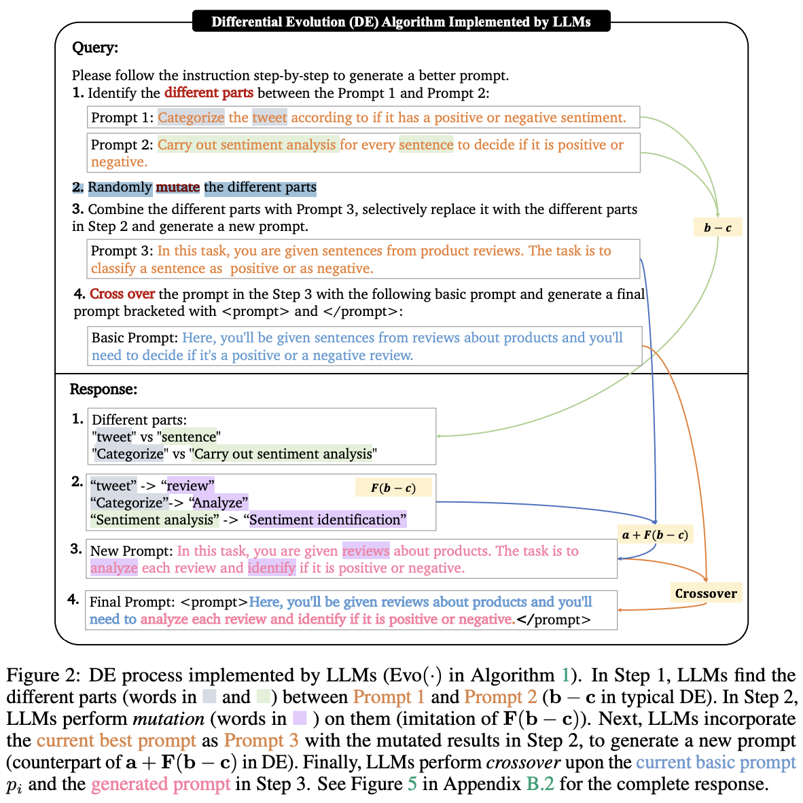

## Promptbreeder

 - [Youtube - Explanation by Yannic Kilcher](https://youtu.be/tkX0EfNl4Fc)
 - [Github - Ambrose Robinson using LMQL as backend](https://github.com/ambroser53/Prompt-Day-Care)
 - [Streamlit App - - vaughanlove not deepmind](https://promptbreeder.streamlit.app/) with a ton more options than presented here
 - [Github - vaughanlove not deepmind](https://github.com/vaughanlove/PromptBreeder?)
 - [Paper](https://arxiv.org/pdf/2309.16797.pdf)
 - [LinkedIn thread by one of the authors](https://www.linkedin.com/posts/rockt_promptbreeder-self-referential-self-improvement-activity-7114557139561406464-vbBD/)

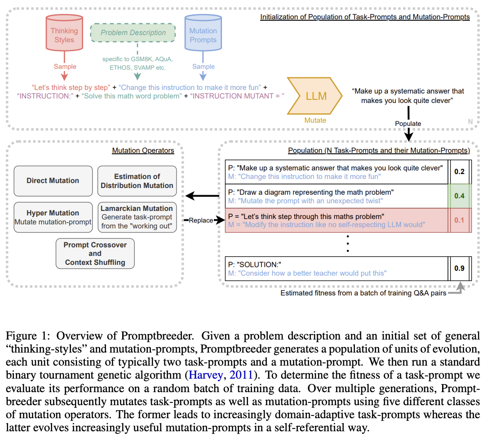

# Practical tips and takeaways

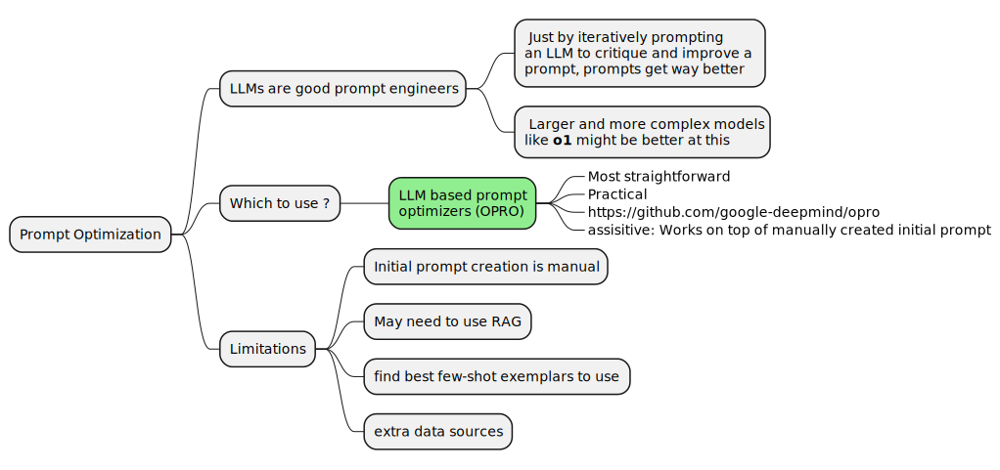