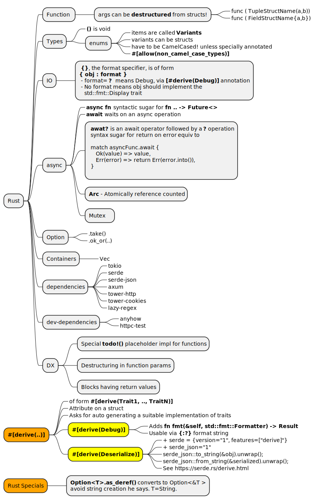
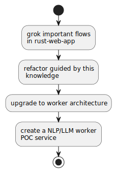

# Rust development - Multi Worker Web Service - on-demand learning in the deep end 

```mermaid
timeline
    title Prog Languages
          
    1994 : Pascal
         : C
         : conio

    1997 : C++
         : Tcl/Tk

    1999 : Perl
         : HTML/CSS

    2000 : C++

    2002 : C++
         : Erlang
         
    2015 : C++
         : Python
         : .NET
         : C#
         : IronPython
         : MFC/OpenGL
                    
    2021 : C++ → Scala
         : Scala
         : ScalaJS
         : LiftWeb/Play
         : Scala/LaminarJS                  
         : HTML/CSS
         : Python
    2022 : ➕ zio
         : ➕ zio-http
         : ➕ zio-grpc

    2023 : Scala → Rust
         : Python
         : Rust
         : React
         : MaterialUI
         : Typescript         
```

If you are a professional developer, the choice of programming languages is typically made for you by the corporate group you join. For personal projects, however, it is a surprising amount of work to settle on a stack. Over the years, I switched from `Erlang → Scala → Rust` as the main language (strongly typed) keeping Python as the main scripting/prototyping language and retaining C++ as a backup. `Erlang` is uncommon, rest assured, I have a story behind it.

I eventually distanced myself from Scala for many reasons. Talking with an old boss made me lookup some random listing of progrsamming language jobs _(as a proxy for popularity and commercial adoption)_ and `rust` was way higher than `scala`. This youtube video, [what can scala learn from rust](https://m.youtube.com/watch?v=GA8NZVGPiNo) by _J. De. Goes_, the creator of Scala's `Zio` library, was another data point. Having used scala macros, I especially loved the demonstrated power of rust macros.

Thus, in 2024, I began my journey into rust. Recognizing that I spent years in scala before applying it to a plausible production scenario, i decided to avoid expensive ramps and jumped right into web-services hoping to discover what the pain points were. I also wanted to see if I could apply [do things that don't scale](https://paulgraham.com/ds.html) approach to the learning of a new language. Glowing reviews on reddit brought me to [Jeremy Chone's Rust Axum Full Course](https://www.youtube.com/watch?v=XZtlD_m59sM). The video was hard to follow as someone brand new to rust, leave alone web-services in rust: however, some on-demand reading was surprisingly enough to take me through this video with advanced rust usage. I used [the rust book's online version at Brown.cs](https://rust-book.cs.brown.edu/) and occasionally reddit.

I decided that I love the language. It is functional, so many things were similar to scala but the syntax also overlapped with `python` and `js` in places. The `#[derive(Debug)]` etc annotations are such a practical way to add boilerplate. Possibly premature, but I think I have found my forever language :-). Also, cargo and related ecosystem is very user friendly: good riddance to `sbt`.

I am listing some of the rust-specific notes I had taken while going through [Jeremy Chone's Rust Axum Full Course](https://www.youtube.com/watch?v=XZtlD_m59sM).cd .

 

# Update rust-web-app to include a LLM/NLP service API

I had an end-goal to guide me: a web-based test-bench to experiment with LLMs and NLP ultimately providing me with a text-to-animation service. I wanted to see if the idea in my head looked just as good on a web-page. The consoltion prize was general backend and front-end arch/design/development suitable for 2024 as opposed to my circa 2000 Perl/CGI. This is the rough plan as an activity diagram _(If I had finer estimates, I would have used a gantt chart)_. **Text** to anything, pre-chatGPT days meant some NLP service `(NER, POS Tagging, CoRef resolution etc)`: meaning, I needed a target architecture that'll allow multiple services. Since k8s was on my radar, this meant multiple communicating services. The starting plan was to update  rust-web-app into a muti-service deployment with something to route API requests _(gRPC or REST)_ to the appropriate service. I hoped that this'd be an excellent way to learn Rust as well.

## Grok and Doc rust-web-app

> You heard it here first: `grok and doc` 😁

After I completed [Jeremy Chone's Rust Axum Full Course](https://www.youtube.com/watch?v=XZtlD_m59sM), I decided to checkout the more production oriented version of it. This was broken into mulitple videos, each long and dense:

 - [Episode 01: Rust Web App Production Coding](https://www.youtube.com/watch?v=3cA_mk4vdWY&list=PL7r-PXl6ZPcCIOFaL7nVHXZvBmHNhrh_Q)
 - [Episode 02: Rust sea-query for Production coding - SeaQuery + ModQL](https://www.youtube.com/watch?v=-dMH9UiwKqg&list=PL7r-PXl6ZPcCIOFaL7nVHXZvBmHNhrh_Q)
 - [Episode 03: Rust Workspace for Production Coding By Example](https://www.youtube.com/watch?v=zUxF0kvydJs&list=PL7r-PXl6ZPcCIOFaL7nVHXZvBmHNhrh_Q)
 - [Episode 04: Multi-Scheme Password Hashing with Argon 2](https://www.youtube.com/watch?v=3E0zK5h9zEs&list=PL7r-PXl6ZPcCIOFaL7nVHXZvBmHNhrh_Q)
 - [Episode 05.1: Rust RPC Router - Axum/Tower/Bevy Style](https://www.youtube.com/watch?v=Gc5Nj5LJe1U&list=PL7r-PXl6ZPcCIOFaL7nVHXZvBmHNhrh_Q)

I documented the important videos _(backburnered the sql/seq-query ones to later)_ and ultimately posted them on github to contribute back. I'm including some of the activity diagrams below. 

---
## OSS Contribution - Contribute architecture diagrams

### Axum intro concepts

### Axum request to response

### Auth flow

### Rest of the docs

 The rest of the docs are at 👉 [github - vamsi-juvvi/rust-web-app/docs/base-rust-web-app](https://github.com/vamsi-juvvi/rust-web-app/tree/main/docs/base-rust-web-app) and listed individually below:

 - [E00 - Rust Axum Intro](https://github.com/vamsi-juvvi/rust-web-app/blob/main/docs/base-rust-web-app/E00%20-%20Rust%20Axum%20Intro.md)
 - [E01 - Intro to production.md](https://github.com/vamsi-juvvi/rust-web-app/blob/main/docs/base-rust-web-app/E01%20-%20Intro%20to%20production.md)
 - [E05 - Rust RPC Router.md](https://github.com/vamsi-juvvi/rust-web-app/blob/main/docs/base-rust-web-app/E05%20-%20Rust%20RPC%20Router.md)
 - [RustWebApp_DesignDiagrams.md](https://github.com/vamsi-juvvi/rust-web-app/blob/main/docs/base-rust-web-app/RustWebApp_DesignDiagrams.md)

## OSS Contribution - Refactor rust-web-app to allow worker architecture

The refactorign was pretty straightforward. I wanted to achieve the following library/crate structure:

```mermaid
block-beta
  columns 4
  a["services/web-server"]:4  
  d1["lib-auth"] 
  d2["lib-core"] 
  
  block:grouprpc:1
  columns 1
    d3["lib-rpc-app"] 
    d31["lib-rpc-core"] 
  end

  d4["lib-utils"]  

style d3 fill:#292
```

---

```mermaid
block-beta
  columns 6
  A["services/web-server"]:6
  b1["axum"]:1
    block:crates:5
    columns 5
        
        D1["lib-auth"]        
        D2["lib-utils"]        
        D3["lib-core"]        

        block:rpc:1
            columns 1
            C1["lib-rpc-app"]
            D4["lib-rpc-core"]
        end
        
        C2["lib-web"]        

    end

style A fill:#292
style C1 fill:#292
style C2 fill:#292
style D1 fill:#559
style D2 fill:#559
style D3 fill:#559
style D4 fill:#292
```
---
And got it done with these two PRs.

 - [PR#17 refactoring of lib-rpc](https://github.com/rust10x/rust-web-app/pull/17) supplemented with [my proposal doc for lib_rpc refactoring](https://github.com/vamsi-juvvi/pr-hub/blob/main/2024-Aug%20refactor%20rust-web-app/Rust10x_REFACTOR_librpc.md)
 - [PR#18 refactoring of lib-wed](https://github.com/rust10x/rust-web-app/pull/18) supplemented with [my proposal doc for lib_web refactoring](https://github.com/vamsi-juvvi/pr-hub/blob/main/2024-Aug%20refactor%20rust-web-app/Rust10x_REFACTOR_libweb.md)
 - I was totally surprised _(gratified and tickled as well)_ that the author decided to make a short video describing my PRs. [Jeremy Chones video describing the PRs - 2 Cool Pull Requests for Rust Web App Blueprint](https://www.youtube.com/watch?v=MHwpSZA2uNA). 🙏 Jeremy! for my first mention on youtube.

## OSS Contribution - Upgrade rust-web-app to worker architecture

```mermaid
block-beta
  columns 8
  F["Frontend"]:3 space:2 A["web-gateway"]:3
  space:8
  A2["Worker1"]:3 A3["Worker2"]:3 A4["Worker3"]:2

  b1["axum"]:1
    block:crates:7
    columns 7
        
        D1["lib-auth"]        
        D2["lib-utils"]        
        D3["lib-core"]        

        block:rpc:1
            columns 1
            A5["lib-rpc-myapp"]
            D4["lib-rpc-core"]
        end
        
        C2["lib-web"]
        A6["lib-mylib1"]
        A7["lib-mylib2"]

    end

style A  fill:#933
style F  fill:#A33
style A2 fill:#933
style A3 fill:#933
style A4 fill:#933
style A5 fill:#933
style A6 fill:#933
style A7 fill:#933

style C2 fill:#292
style D1 fill:#559
style D2 fill:#559
style D3 fill:#559
style D4 fill:#292

F-- "REST, jsonRPC, Auth" -->A
A-- "RPC" -->A2
A-- "RPC" -->A3
A-- "RPC" -->A4
```

Actually having to design new libs is a very different matter from refactoring existing ones. Engaging in design thinking needs quite a bit more fluency with the programming language semantics. I could still manage all this with on-demand learning and still haven't cracked the rust book open. So much time is saved when you `do things that don't scale`.

### PRs

 - [PR: Adding worker architecture ](https://github.com/vamsi-juvvi/rust-web-app/pull/1) This was for my own benefit. I already knew that Jeremy had a plan to introduce an event-driven archiutecture based on redis/valkey. However, since I found this simple gateway/worker useful, decided to push it to my fork. Turns out a few other people found it and forked it since.
 - [📁 Documents](https://github.com/vamsi-juvvi/rust-web-app/tree/main/docs) these are also listed inline below and include the following. The folders contain the `puml` source used to generate the diagrams.
   - [📁 Understanding the base rust-web-app](https://github.com/vamsi-juvvi/rust-web-app/tree/main/docs/00_base-rust-web-app)
   - [📁 Refactoring lib_rpc and lib_web](https://github.com/vamsi-juvvi/rust-web-app/tree/main/docs/01_refactor_lib_rpc_lib_web)
   - [📁 Worker architecute](https://github.com/vamsi-juvvi/rust-web-app/tree/main/docs/02_worker_architecture)
   - [📁 Eevent driven architecture](https://github.com/vamsi-juvvi/rust-web-app/tree/main/docs/03_event_driven_architecture) WIP and will be completed when I feel the need for it.

### Worker architecture

I went through a design exercise (generating the following mind-map in the process) and eventually decided to make progress with a hub-spoke model. EDA required more work, brokers, Knative -vs- custom and all that. 

This is an other obvious way to decouple multiple-services. In a web-context with authentication, especially, it was straightforward to think of

 - Gateway service which primarily manages
   - Authentication
   - Authenticated access to services 
   - Resolution of API calls into service calls
 - Workers 
   - Don't care about authentication
   - Get a user-context from the gateway which would've authenticated the user
 - The only coupling between gateway and workers is via service lookup information.
 - _Brittle if workers were to talk to each other etc. However, by then, I will likely switch to an EDA_.

This is expected to result in this type of activity.

and result in this complete actibity diagram

The final deployment would look like below

with 4 different processes _(on WSL, they will all be transparently mapped to localhost)

The workers themselves are resolved with a simple file so I don't have to bother with a full featured DNS

### Future Work - Event Driven Architecture

At this point, I had also considered `EDA` _(Event Driven Architecture: A term that always startles me as many years at Ansoft have conditioned me to think Electronic Design Automation)_. While I did think a bit about it and came up with the following component diagram, ultimately skipped it because I did not want to add needless complexity with KNative and figure out eventing stuff. Plain k8s with hub-spoke communicating pods is simple to get a POC up and running.

 - This is conceptual, details were not very well researched. I just wanted a high-level image to guide my thinking.
 - the `ce-` prefixes are specific to `KNative`'s event envelopes which contain the domain-specific event packets. If you use other eventing inrfastructure, the details will slightly change but you'll eventually use a framework specific event envelope that contains your event data.
